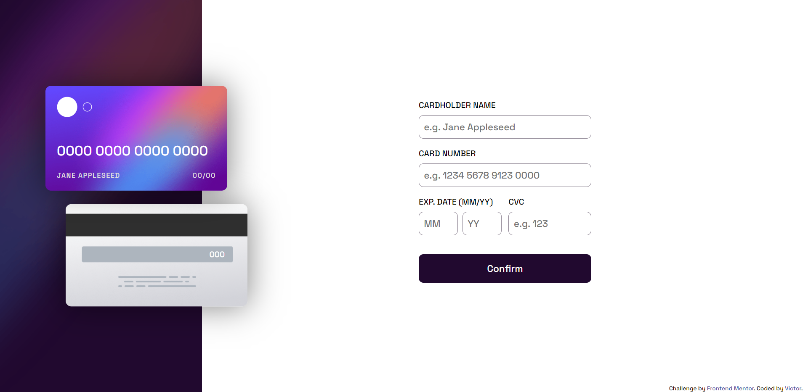

# Frontend Mentor - Interactive card details form solution

This is a solution to the [Interactive card details form challenge on Frontend Mentor](https://www.frontendmentor.io/challenges/interactive-card-details-form-XpS8cKZDWw). Frontend Mentor challenges help you improve your coding skills by building realistic projects. 

## Table of contents

- [Overview](#overview)
  - [The challenge](#the-challenge)
  - [Screenshot](#screenshot)
  - [Links](#links)
- [My process](#my-process)
  - [Built with](#built-with)
  - [What I learned](#what-i-learned)
  - [Continued development](#continued-development)
  - [Useful resources](#useful-resources)
- [Author](#author)
- [Acknowledgments](#acknowledgments)

**Note: Delete this note and update the table of contents based on what sections you keep.**

## Overview

### The challenge

Users should be able to:

- Fill in the form and see the card details update in real-time
- Receive error messages when the form is submitted if:
  - Any input field is empty
  - The card number, expiry date, or CVC fields are in the wrong format
- View the optimal layout depending on their device's screen size
- See hover, active, and focus states for interactive elements on the page

### Screenshot



### Links

- Solution URL: [https://github.com/victor247k/InteractiveCardDetails]
- Live Site URL: [https://victor247k.github.io/InteractiveCardDetails/]

## My process

### Built with

- Semantic HTML5 markup
- CSS
- Flexbox
- JS

### What I learned

I have learned how to better set up the markup, how to style a bit better, what mistakes to naot make again, I alos got more comfortable using forms and inputs.

```html
<div class="inputNameContainer flex">
    <label for="inputName">CARDHOLDER NAME</label>
    <input id="inputName" type="text" placeholder="e.g. Jane Appleseed">
    <p class="errorMessage nameError"> </p>
</div>
```


### Continued development

I have to practice more doing responsive designs and also how to better do th layout, also I am not entirly happy with the js code, so I will have to improve in that rea aswell.

### Useful resources

- [Example resource 1](https://www.youtube.com/@WebDevSimplified) - Very good and cool tutorials. It helped me a lot.

## Author

- Instagram - [victorspinei247](https://www.instagram.com/victorspinei247/)
- Frontend Mentor - [@victor247k](https://www.frontendmentor.io/profile/victor247k)
- GitHub - [@victor247k](https://github.com/victor247k)


## Acknowledgments

I am thankful for this challenge, I have found areas in wich I am not yet comfortable to hande and in wich I have to improve further down my jorney.
